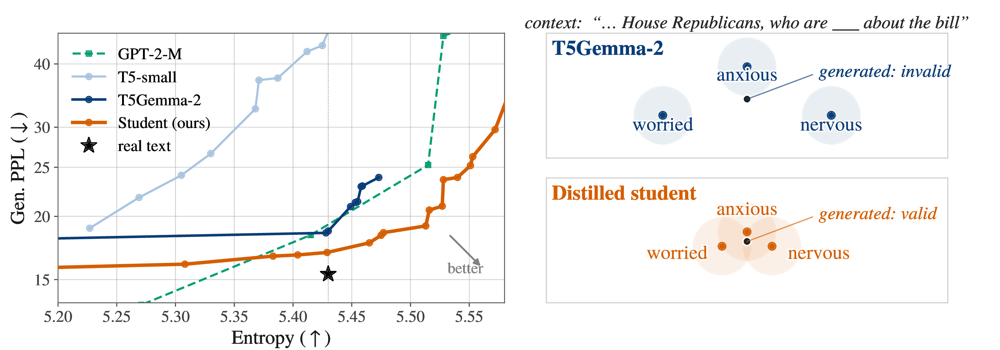
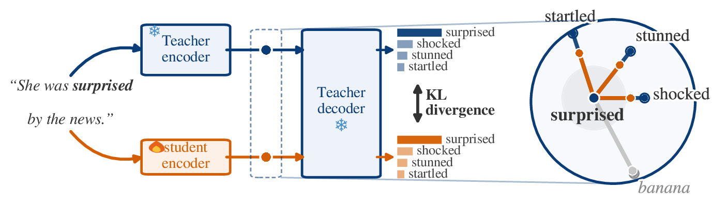
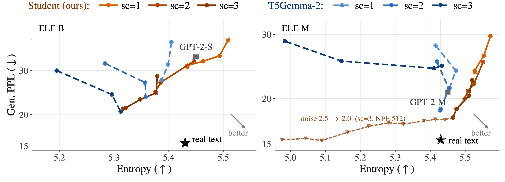

# Scaling and Distilling Text Embeddings for Better Diffusibility

<p align="center">
  <a href="https://la0ka1.github.io/diffusing-scaled-text-embeddings/"></a>
  <a href="#"></a>
  <a href="https://huggingface.co/collections/la0ka1/diffusing-scaled-text-embeddings-6abd7ff3c91fd70bd749c197"></a>
  <a href="LICENSE"></a>
</p>

Code for the paper **Scaling and Distilling Text Embeddings for Better Diffusibility**.

Continuous diffusion language models (DLMs) are a promising alternative to autoregressive models, and they are
latent diffusion on text embeddings. Which text embedding makes the best latent space for them,
i.e. the most diffusible one? We fix the DLM to the recent [ELF](https://github.com/lillian039/ELF)
framework and change only the embedding:

- **Scaling.** Replacing the [T5-small](https://huggingface.co/google-t5/t5-small) encoder of ELF
  with [T5Gemma-2](https://huggingface.co/google/t5gemma-2-270m-270m) lowers the generative
  perplexity (Gen. PPL) by about 40% at the same entropy.
- **Distilling.** Distilling the T5Gemma-2 encoder into a student improves diffusibility further,
  reducing Gen. PPL from 19.3 to 17.8 at real-text entropy and sampling more stably.

<p align="center">
  
</p>

We train the student on the soft labels, i.e. the predicted probabilities from the teacher decoder:

<p align="center">
  <a href="figures/distillation.png"></a>
</p>

This repository offers the sampling code and the [checkpoints](https://huggingface.co/collections/la0ka1/diffusing-scaled-text-embeddings-6abd7ff3c91fd70bd749c197) to
reproduce the results of the paper, and also the code to distill and train your own models. It is
adapted from [ELF-pytorch](https://github.com/Ugness/ELF-pytorch), a PyTorch reproduction of ELF
on OpenWebText.

## Setup

```bash
pip install -r requirements.txt
```

Tested with Python 3.10, PyTorch 2.7 and transformers 5.16. Sampling and evaluation need no
Hugging Face login: each checkpoint is downloaded, with the T5Gemma-2 tokenizer, from
[its repository](https://huggingface.co/collections/la0ka1/diffusing-scaled-text-embeddings-6abd7ff3c91fd70bd749c197). Distilling, or
training ELF on T5Gemma-2 or on the released student, builds the encoder from the gated
[T5Gemma-2](https://huggingface.co/google/t5gemma-2-270m-270m): accept the terms on its model page
and run `hf auth login` first.

## Sample from the released checkpoints

```bash
python sample.py --ckpt ELF-M-T5Gemma2distilled --out samples.json --n 1024 --sc 3 --nfe 512
python evaluate.py --samples samples.json
```

`--ckpt` takes the name of a released checkpoint, downloaded from Hugging Face on first use, or
your own `model.pt`; `--sc` is the self-conditioning guidance scale and `--nfe` the number of
sampling steps.[^1] `evaluate.py` reports the perplexity of the generated text under GPT-2-Large
(Gen. PPL) and its unigram entropy. Expected, as the mean over 3 seeds with 1024 samples each:[^2]

| `--ckpt` | `--sc` | `--nfe` | Gen. PPL | Entropy |
| --- | --- | --- | --- | --- |
| [`ELF-B-T5Gemma2`](https://huggingface.co/la0ka1/ELF-B-T5Gemma2) | 1 | 64 | 38.5 | 5.41 |
| [`ELF-B-T5Gemma2distilled`](https://huggingface.co/la0ka1/ELF-B-T5Gemma2distilled) | 1 | 256 | 31.2 | 5.44 |
| [`ELF-M-T5Gemma2`](https://huggingface.co/la0ka1/ELF-M-T5Gemma2) | 2 | 256 | 19.3 | 5.44 |
| [`ELF-M-T5Gemma2distilled`](https://huggingface.co/la0ka1/ELF-M-T5Gemma2distilled) | 3 | 512 | 17.8 | 5.45 |
| real text | | | 15.4 | 5.43 |

<p align="center">
  <a href="figures/sampling.png"></a>
</p>

[^1]: The SDE sampler with churn 1.5 and noise scale 2.0. Sampling needs only the ELF checkpoint
    and the tokenizer: ELF decodes its embeddings with its own head, so the encoder is never loaded.
[^2]: T5Gemma-2 with ELF-B never reaches the entropy of real text on our sampling grid, so its
    row is the setting with the highest entropy.

`examples/` holds 16 generated sequences per model at these settings (seed 0, text only), for a look
without a GPU.

The real-text row and MAUVE compare against held-out OpenWebText, which `data.py` prepares once
(it downloads OpenWebText but tokenizes only the held-out documents):

```bash
python data.py --out data/owt --heldout-only                         # data/owt_heldout
python evaluate.py --real data/owt_heldout --n 256                   # real-text row
python evaluate.py --samples samples.json --mauve data/owt_heldout   # adds MAUVE
```

## Train your own models

The full pipeline; the runs of the paper used 8 H100 GPUs. Skip step 2 to use our released
student ([`T5Gemma-2-270M-OWTdistilled`](https://huggingface.co/la0ka1/T5Gemma-2-270M-OWTdistilled)), which is the default `--encoder`.

```bash
# 1. tokenize OpenWebText: about 9.0M sequences of up to 1024 tokens; the last 193,769 documents form data/owt_heldout
python data.py --out data/owt
# 2. distill the student: 50,000 steps at a global batch of 256 (8 x 32), 38.6 hours; best held-out checkpoint in runs/student/best.pt
torchrun --standalone --nproc_per_node=8 distill.py --data data/owt --out runs/student
# 3. train ELF: 5 epochs at a global batch of 512 (GPUs x --batch-size x --accum)
torchrun --standalone --nproc_per_node=8 train.py --data data/owt --out runs/student_elf_m \
    --encoder runs/student/best.pt --model ELF-M --batch-size 8 --accum 8
# 4. sample and evaluate as above
python sample.py --ckpt runs/student_elf_m/model.pt --out samples.json --n 1024 --sc 3 --nfe 512
```

The other models of the paper differ only in flags:

```bash
# ELF-B
torchrun --standalone --nproc_per_node=8 train.py --data data/owt --out runs/student_elf_b \
    --encoder runs/student/best.pt --model ELF-B --batch-size 16 --accum 4
# T5Gemma-2 instead of the student
torchrun --standalone --nproc_per_node=8 train.py --data data/owt --out runs/t5gemma2_elf_m \
    --encoder google/t5gemma-2-270m-270m --model ELF-M --batch-size 8 --accum 8
# distillation ablations: hard labels, and regressing the teacher's embeddings
torchrun --standalone --nproc_per_node=8 distill.py --data data/owt --out runs/student_ce --objective ce
torchrun --standalone --nproc_per_node=8 distill.py --data data/owt --out runs/student_mse --objective mse
```

`--batch-size` is per GPU and `--accum` the number of gradient accumulation steps; change them
together to keep the global batch at 512. An interrupted run continues with
`--resume <out>/checkpoint.pt`.

## Files

| File | Content |
| --- | --- |
| `data.py` | OpenWebText token cache and held-out split |
| `encoders.py` | frozen encoder (T5Gemma-2 or the student), embedding normalization, checkpoint download |
| `distill.py` | distillation of the student |
| `train.py` | ELF-B / ELF-M training on a chosen embedding |
| `sample.py` | sampling and decoding to text |
| `evaluate.py` | Gen. PPL, unigram entropy, MAUVE |
| `elf/` | the ELF model, flow matching losses, sampler, Muon optimizer |
| `docs/` | source of the project page (`docker compose up` in it for a local preview) |
| `examples/` | 16 generated sequences per released model |

## Acknowledgement

The files in `elf/` and the metrics in `evaluate.py` are derived from
[ELF-pytorch](https://github.com/Ugness/ELF-pytorch) (MIT License; its notice is kept in
`LICENSE`), and the data format in `data.py` follows [ELF](https://github.com/lillian039/ELF).

<!-- ## Citation

```bibtex
@article{zhang2026scaling,
  title={Scaling and Distilling Text Embeddings for Better Diffusibility},
  author={Zhang, Zekai and Tian, Yunjie and He, Yanjin and Zhang, Xiaoyan and Zhao, Dongdi and Qu, Qing and Fu, Di},
  year={2026}
}
``` -->
